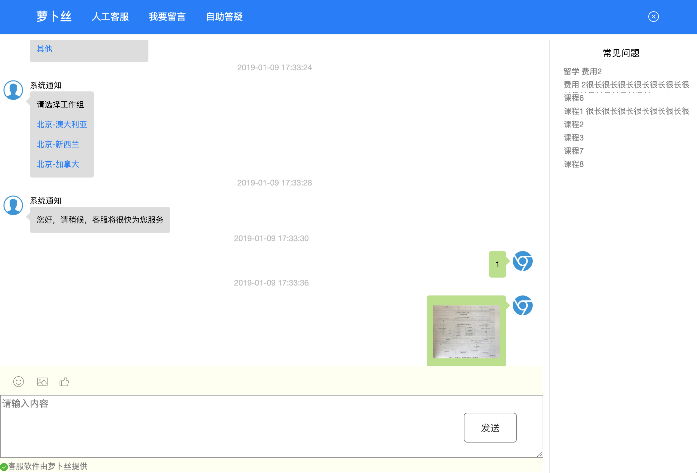
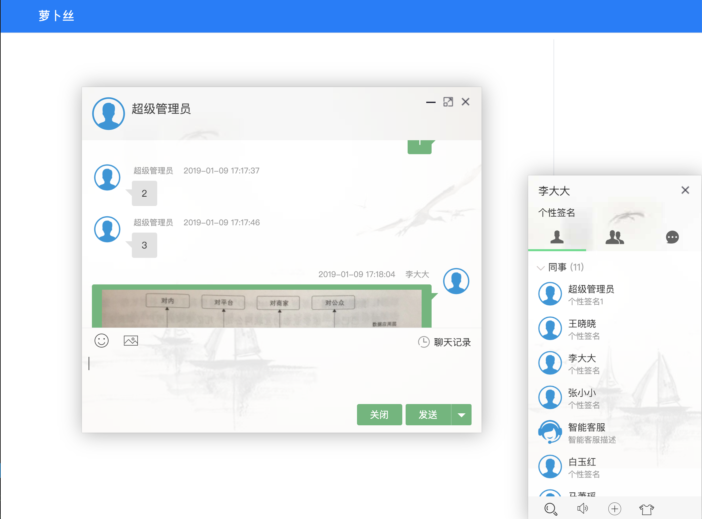

# 萝卜丝 · IM + 云客服

- 致力于提供稳定、可扩展、定制化的客户服务一站式平台
- [官方网站](https://www.bytedesk.com)

## 准备工作

- [注册账号](https://www.bytedesk.com/antv/user/login)
- [登录后台](https://www.bytedesk.com/admin#/login)
- 分配应用：登录后台->客服->渠道->添加Web

## 开发文档

- [5分钟集成在线客服](https://github.com/Bytedesk/bytedesk-web/wiki/5%E5%88%86%E9%92%9F%E9%9B%86%E6%88%90%E5%9C%A8%E7%BA%BF%E5%AE%A2%E6%9C%8D)
- [5分钟集成工单](https://github.com/Bytedesk/bytedesk-web/wiki/5%E5%88%86%E9%92%9F%E9%9B%86%E6%88%90%E5%B7%A5%E5%8D%95)
- [5分钟集成帮助中心](https://github.com/Bytedesk/bytedesk-web/wiki/5%E5%88%86%E9%92%9F%E9%9B%86%E6%88%90%E5%B8%AE%E5%8A%A9%E4%B8%AD%E5%BF%83)
- [5分钟集成意见反馈](https://github.com/Bytedesk/bytedesk-web/wiki/5%E5%88%86%E9%92%9F%E9%9B%86%E6%88%90%E6%84%8F%E8%A7%81%E5%8F%8D%E9%A6%88)

## 说明

- kefu文件夹中是 在线客服演示，方便开发者自定义访客端UI，
- im文件夹中是 im演示，支持一对一、群组聊天等，

## 其他

- [iOS SDK](https://github.com/bytedesk/bytedesk-ios)
- [Android SDK](https://github.com/bytedesk/bytedesk-android)
- [Web端接口](https://github.com/bytedesk/bytedesk-web)
- [微信公众号/小程序接口](https://github.com/bytedesk/bytedesk-wechat)
- [服务器端接口](https://github.com/bytedesk/bytedesk-server)
- [机器人](https://github.com/bytedesk/bytedesk-chatbot)
