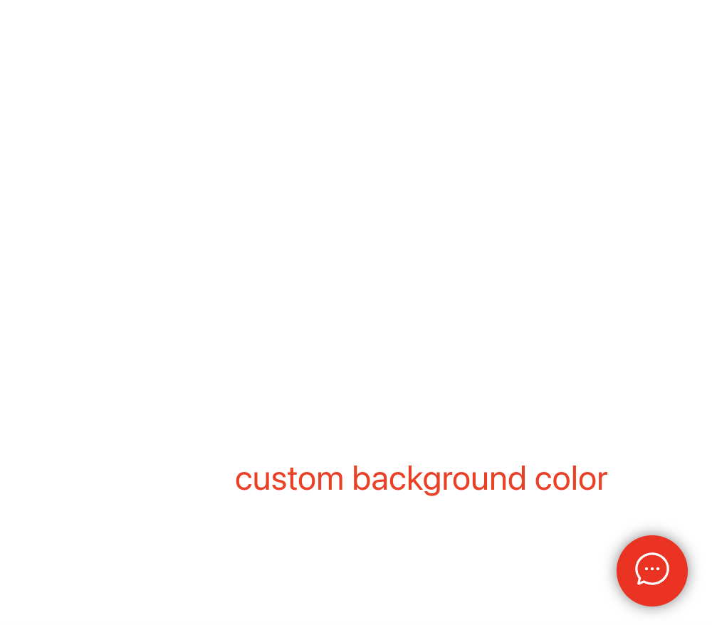

<!--
 * @Author: jackning 270580156@qq.com
 * @Date: 2024-02-28 10:53:41
 * @LastEditors: jackning 270580156@qq.com
 * @LastEditTime: 2024-06-14 14:04:13
 * @Description: bytedesk.com https://github.com/Bytedesk/bytedesk
 *   Please be aware of the BSL license restrictions before installing Bytedesk IM – 
 *  selling, reselling, or hosting Bytedesk IM as a service is a breach of the terms and automatically terminates your rights under the license. 
 *  仅支持企业内部员工自用，严禁私自用于销售、二次销售或者部署SaaS方式销售 
 *  Business Source License 1.1: https://github.com/Bytedesk/bytedesk/blob/main/LICENSE 
 *  contact: 270580156@qq.com 
 * 联系：270580156@qq.com
 * Copyright (c) 2024 by bytedesk.com, All Rights Reserved. 
-->
# bytedesk web chat float demo

bytedesk.com web lib for customer service chat widget

```js
<script src="./index.js"></script>
<script>
    // init chatfloat, and init params
    window.ChatFloat({
        chatUrl: 'http://localhost:9006/chat?t=1&sid=default_wg_uid&', // custom chat url
        //buttonPosition: 'right', // botton position：left or right
        //buttonBackgroundColor: 'blue', // button background color
        //iframeMargins: { right: 20, bottom: 20, left: 20 }, // iframe margins
        //buttonMargins: { right: 20, bottom: 20, left: 20 }, // button margins
        //showButton: true, // show button or not
        //showIframe: true // show iframe or not
    });
</script>
```

## chatfloat jquery demo

```js
<script type="text/javascript" src="https://cdn.kefux.com/assets/js/vendor/jquery/1.9.1/jquery.min.js"></script>
<div id="bytedesk-float-chat"></div>
<script src="index.js"></script>
<script>
    $(document).ready(function () {
        $('#bytedesk-float-chat').ChatFloat({
            chatUrl: 'http://localhost:9006/chat?t=1&sid=default_wg_uid&',
            //buttonPosition: 'right', // botton position：left or right
            //buttonBackgroundColor: 'blue', // button background color
            //iframeMargins: { right: 20, bottom: 20, left: 20 }, // iframe margins
            //buttonMargins: { right: 20, bottom: 20, left: 20 }, // button margins
            //showButton: true, // show button or not
            //showIframe: true // show iframe or not
        });
    });
</script>
```

## Example

| custom button color |  custom button left | custom button margin | custom iframe margin | custom iframe width |
| :----------: | :----------: | :----------:  | :----------: | :----------: |
|  |  |  |  |  |
