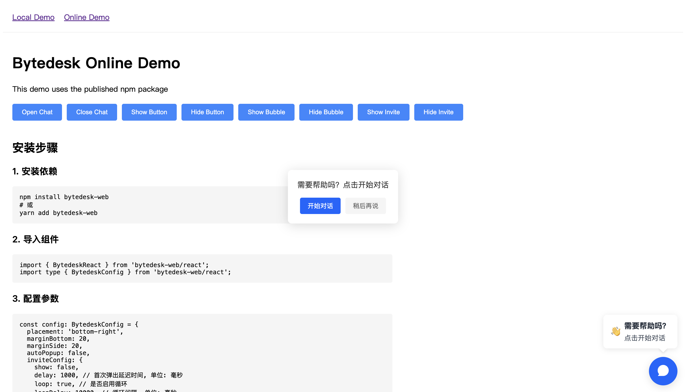

<!--
 * @Author: jackning 270580156@qq.com
 * @Date: 2024-12-28 12:45:03
 * @LastEditors: jackning 270580156@qq.com
 * @LastEditTime: 2025-03-07 07:20:52
 * @Description: bytedesk.com https://github.com/Bytedesk/bytedesk
 *   Please be aware of the BSL license restrictions before installing Bytedesk IM – 
 *  selling, reselling, or hosting Bytedesk IM as a service is a breach of the terms and automatically terminates your rights under the license. 
 *  仅支持企业内部员工自用，严禁私自用于销售、二次销售或者部署SaaS方式销售 
 *  Business Source License 1.1: https://github.com/Bytedesk/bytedesk/blob/main/LICENSE 
 *  contact: 270580156@qq.com 
 *  联系：270580156@qq.com
 * Copyright (c) 2024 by bytedesk.com, All Rights Reserved. 
-->
# bytedesk-web

Online customer service SDK, supporting multiple frameworks:

- [React Guide](examples/react-demo/readme.md)
- [Next.js Guide](examples/nextjs-demo/readme.md)
- [Vue Guide](examples/vue-demo/readme.md)
- [Svelte Guide](examples/svelte-demo/readme.md)
- [Angular Guide](examples/angular-demo/readme.md)
- [JavaScript Guide](examples/javascript-demo/readme.md)




[中文文档](readme.zh.md)

- [](https://badge.fury.io/js/bytedesk-web)
- [](https://www.npmjs.com/package/bytedesk-web)
- [npmjs](https://www.npmjs.com/package/bytedesk-web)

## Installation Steps

### Install Dependencies

```bash
npm install bytedesk-web
# or
yarn add bytedesk-web
```

### Import Component

```bash
import { BytedeskReact } from 'bytedesk-web/react';
import type { BytedeskConfig } from 'bytedesk-web/react';
# or
# import type { BytedeskConfig } from 'bytedesk-web';
```

### Configure Parameters

```bash
const config: BytedeskConfig = {
  placement: 'bottom-right',
  marginBottom: 20,
  marginSide: 20,
  bubbleConfig: {
    show: true,
    icon: '👋',
    title: 'Need help?',
    subtitle: 'Click to chat'
  },
  chatConfig: {
    org: 'df_org_uid',  // Replace with your organization ID
    t: "2",
    sid: 'df_rt_uid'      // Replace with your SID
  }
};
```

### Use Component

```bash
const App = () => {
  const handleInit = () => {
    console.log('BytedeskReact initialized');
  };

  return (
    <div>
      <BytedeskReact {...config} onInit={handleInit} />
      <button onClick={() => (window as any).bytedesk?.showChat()}>
        Open Chat
      </button>
    </div>
  );
};
```

### Available Methods

```bash
# show/hide button
(window as any).bytedesk?.showButton();
(window as any).bytedesk?.hideButton();

# show/hide bubble
(window as any).bytedesk?.showBubble();
(window as any).bytedesk?.hideBubble();

# show/hide chat window
(window as any).bytedesk?.showChat();
(window as any).bytedesk?.hideChat();

# show/hide invite dialog
(window as any).bytedesk?.showInviteDialog();
(window as any).bytedesk?.hideInviteDialog();
```

## Run Examples

```bash
yarn install
yarn demo:react    # Run React demo
yarn demo:vue      # Run Vue demo
yarn demo:svelte   # Run Svelte demo
yarn demo:vanilla  # Run Vanilla JS demo
yarn demo:angular  # Run Angular demo
yarn demo:nextjs   # Run Next.js demo

# JavaScript demo requires build first
yarn build
yarn demo:javascript
```

## CDN

```bash
# https://cdn.jsdelivr.net/npm/bytedesk-web@1.2.7/dist/
https://cdn.jsdelivr.net/npm/bytedesk-web@1.2.7/dist/bytedesk-web.js
https://cdn.jsdelivr.net/npm/bytedesk-web@1.2.7/dist/bytedesk-web.umd.js
```

## Open Source Demo + SDK

| Project     | Description           | Forks          | Stars             |
|-------------|-----------------------|----------------|-------------------|
| [iOS](https://github.com/bytedesk/bytedesk-swift) | iOS  |  |                  |
| [Android](https://github.com/bytedesk/bytedesk-android) | Android |  |   |
| [Flutter](https://github.com/bytedesk/bytedesk-flutter) | Flutter | |  |
| [UniApp](https://github.com/bytedesk/bytedesk-uniapp) | Uniapp |  |  |
| [Web](https://github.com/bytedesk/bytedesk-web) | Vue/React/Angular/Next.js/JQuery/... |  |  |
| [Wordpress](https://github.com/bytedesk/bytedesk-wordpress) | Wordpress |  |  |
| [Woocommerce](https://github.com/bytedesk/bytedesk-woocommerce) | woocommerce |  |  |
| [Magento](https://github.com/bytedesk/bytedesk-magento) | Magento |  |  |
| [Prestashop](https://github.com/bytedesk/bytedesk-prestashop) | Prestashop |  |  |
| [Shopify](https://github.com/bytedesk/bytedesk-shopify) | Shopify |  |  |
| [Opencart](https://github.com/bytedesk/bytedesk-opencart) | Opencart |  |  |
| [Laravel](https://github.com/bytedesk/bytedesk-laravel) | Laravel |  |  |
| [Django](https://github.com/bytedesk/bytedesk-django) | Django |  |  |
