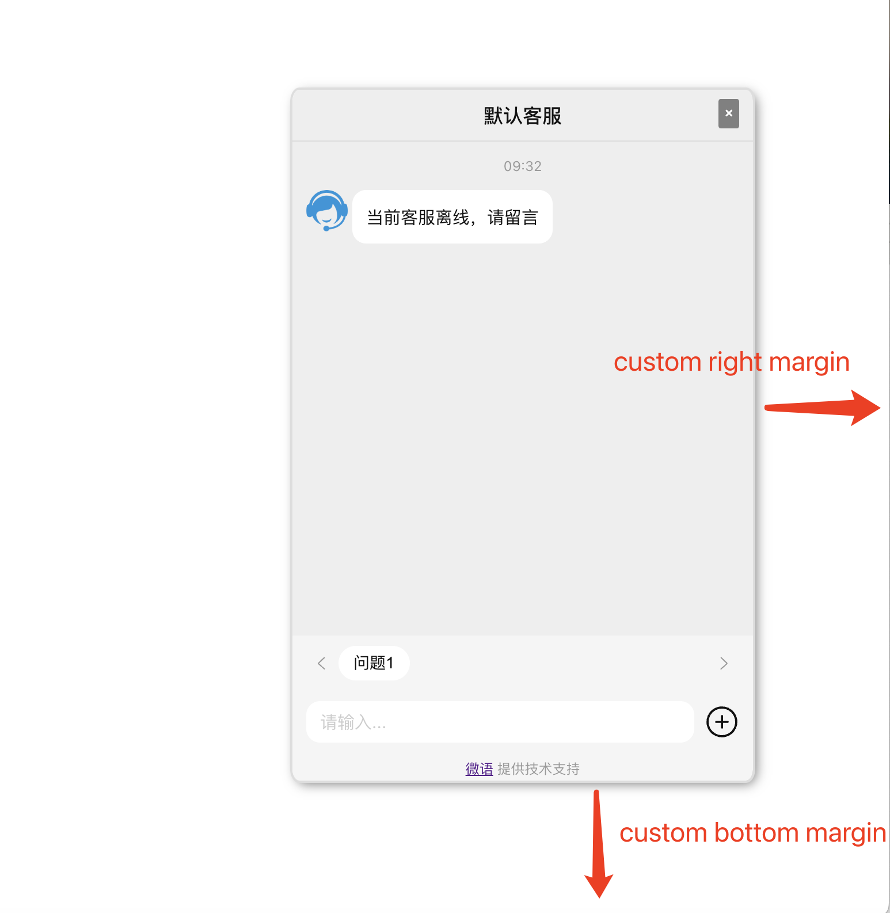
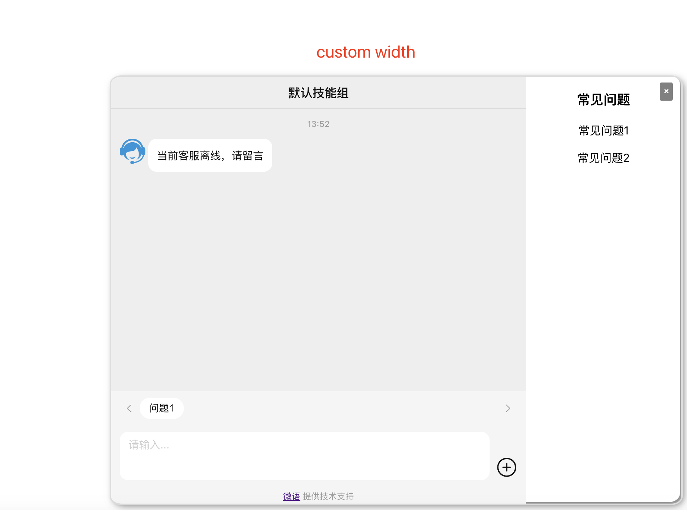

<!--
 * @Author: jackning 270580156@qq.com
 * @Date: 2024-02-28 10:53:41
 * @LastEditors: jackning 270580156@qq.com
 * @LastEditTime: 2024-10-05 21:25:22
 * @Description: bytedesk.com https://github.com/Bytedesk/bytedesk
 *   Please be aware of the BSL license restrictions before installing Bytedesk IM – 
 *  selling, reselling, or hosting Bytedesk IM as a service is a breach of the terms and automatically terminates your rights under the license. 
 *  仅支持企业内部员工自用，严禁私自用于销售、二次销售或者部署SaaS方式销售 
 *  Business Source License 1.1: https://github.com/Bytedesk/bytedesk/blob/main/LICENSE 
 *  contact: 270580156@qq.com 
 * 联系：270580156@qq.com
 * Copyright (c) 2024 by bytedesk.com, All Rights Reserved. 
-->
# bytedesk web chat float demo

bytedesk.com web lib 客服聊天插件

## 语言

- [English](./README.md)
- [中文](./README.zh.md)

## chatfloat demo

```js
<script src="./index.js"></script>
<script>
    // init chatfloat, and init params
    window.ChatFloat({
        chatUrl: 'http://localhost:9006/chat?t=1&sid=default_wg_uid&', // custom chat url
        //buttonPosition: 'right', // 按钮位置：left or right
        //buttonBackgroundColor: 'blue', // 按钮背景色
        //iframeWidth: 400,
        //iframeHeight: 600,
        //iframeMargins: { right: 20, bottom: 20, left: 20 }, // 聊天窗口边距
        //buttonMargins: { right: 20, bottom: 20, left: 20 }, // 按钮边距
        //showButton: true, // 是否显示按钮
        //showIframe: true // 是否显示聊天窗口
    });
</script>
```

## chatfloat jquery demo

```js
<script type="text/javascript" src="https://cdn.kefux.com/assets/js/vendor/jquery/1.9.1/jquery.min.js"></script>
<div id="bytedesk-float-chat"></div>
<script src="index.js"></script>
<script>
    $(document).ready(function () {
        $('#bytedesk-float-chat').ChatFloat({
            chatUrl: 'http://localhost:9006/chat?t=1&sid=default_wg_uid&',
            //buttonPosition: 'right', // 按钮位置：left or right
            //buttonBackgroundColor: 'blue', // 按钮背景色
            //iframeWidth: 400,
            //iframeHeight: 600,
            //iframeMargins: { right: 20, bottom: 20, left: 20 }, // 聊天窗口边距
            //buttonMargins: { right: 20, bottom: 20, left: 20 }, // 按钮边距
            //showButton: true, // 是否显示按钮
            //showIframe: true // 是否显示聊天窗口
        });
    });
</script>
```

## 示例

| 自定义按钮颜色 |  按钮放在窗口左下角 | 自定义按钮边距 | 自定义聊天窗口边距 | 自定义聊天窗口宽度 |
| :----------: | :----------: | :----------:  | :----------: | :----------: |
|  |  |  |  |  |


## 对话SDK

<!-- - [iOS-oc](./visitor/oc)
- [iOS-swift](./visitor/swift)
- [Android](./visitor/android)
- [Flutter](./visitor/flutter)
- [React](./visitor/react)
- [React-native](./visitor/react-native)
- [UniApp](./visitor/uniapp)
- [Web](./visitor/web) -->
<!-- - [iOS-oc](https://github.com/Bytedesk/bytedesk-oc) -->
<!-- - [React-native](https://github.com/bytedesk/bytedesk-react-native) -->
<!-- - [Vue](https://github.com/bytedesk/bytedesk-vue) -->
<!-- - [Browser-Extension](https://github.com/Bytedesk/bytedesk-browser-extention) -->
<!-- - [Vscode-plugin](https://github.com/bytedesk/bytedesk-vscode-plugin) -->
- [iOS-swift](https://github.com/Bytedesk/bytedesk-swift)
- [Android](https://github.com/bytedesk/bytedesk-android)
- [Flutter](https://github.com/bytedesk/bytedesk-flutter)
- [React](https://github.com/bytedesk/bytedesk-react)
- [UniApp](https://github.com/bytedesk/bytedesk-uniapp)
- [Web](https://github.com/bytedesk/bytedesk-web)

## 客户端

- [Windows](https://www.weiyuai.cn/download.html)
- [Mac](https://www.weiyuai.cn/download.html)
- [Linux](https://www.weiyuai.cn/download.html)
- [Android](https://www.weiyuai.cn/download.html)
- [IOS](https://www.weiyuai.cn/download.html)

## 技术栈

<!-- - [sofaboot](https://github.com/sofastack/sofa-boot/blob/master/README_ZH.md) for im server 基于金融级云原生架构-->
- [springboot-3.x for 后端](https://github.com/Bytedesk/bytedesk)
- [python for ai](https://github.com/Bytedesk/bytedesk-ai)
- [react for web前端](https://github.com/Bytedesk/bytedesk-react)
- [flutter for 移动客户端(ios&android)](https://github.com/Bytedesk/bytedesk-mobile)
- [electron for 桌面客户端(windows&mac&linux)](https://github.com/Bytedesk/bytedesk-desktop)

## 联系

- [Email](mailto:270580156@qq.com)
- [微信](./image/wechat.png)
