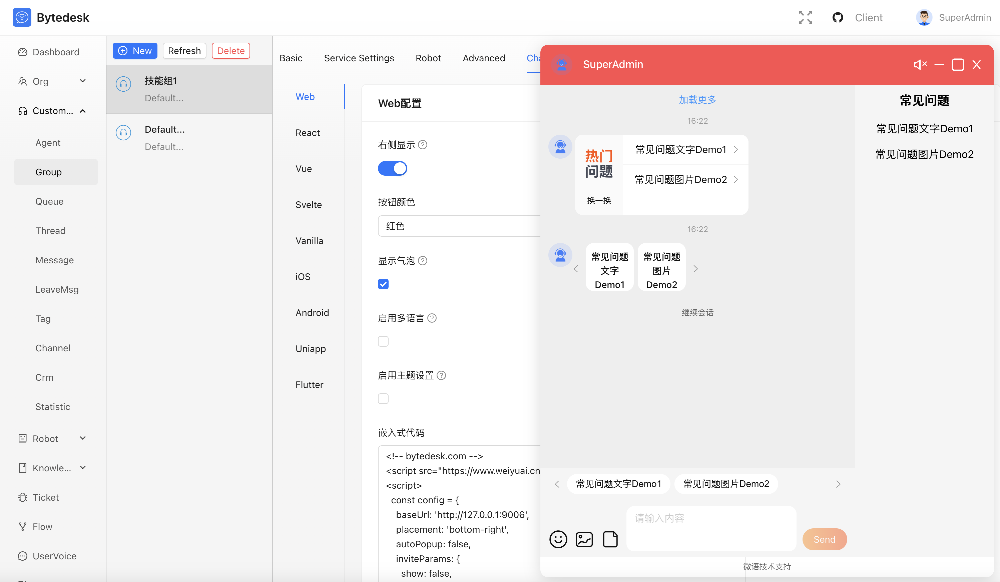
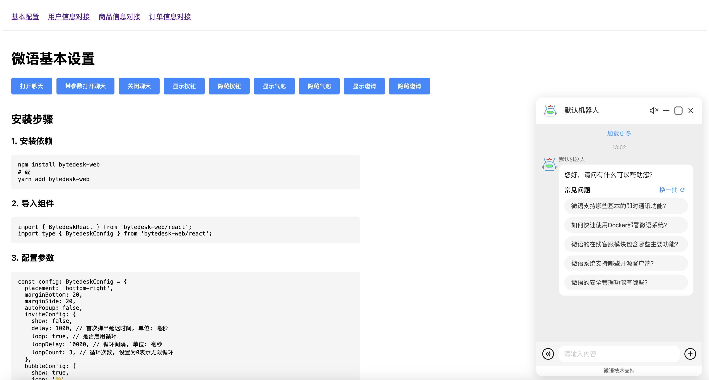
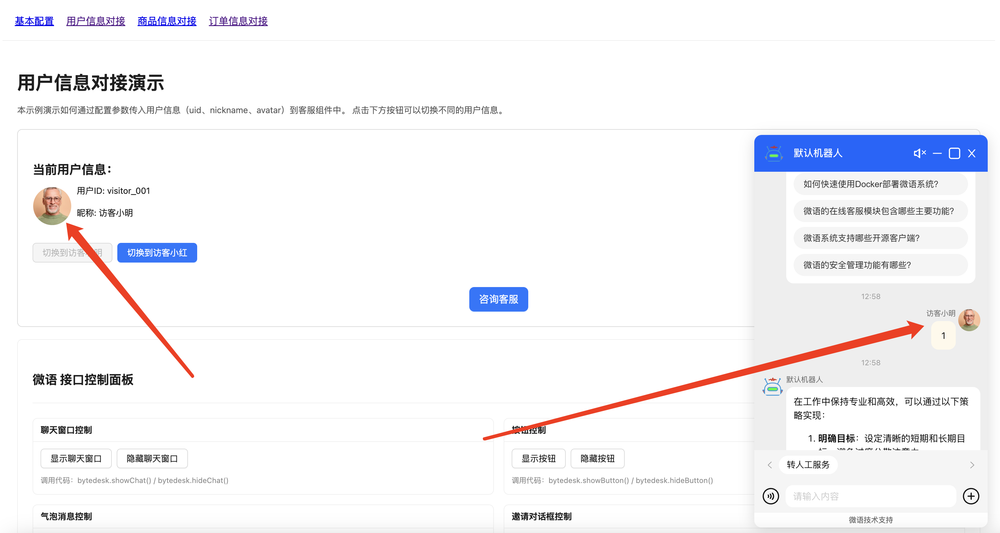
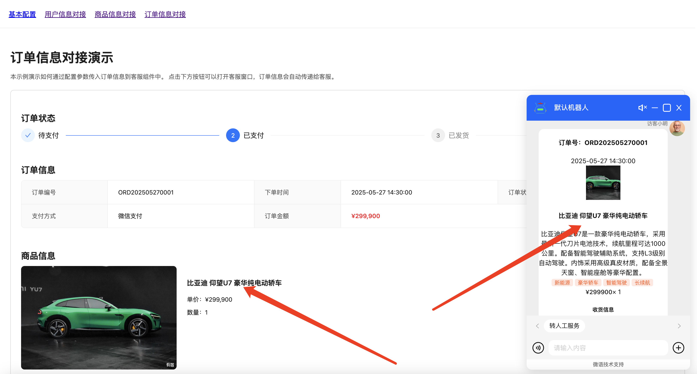
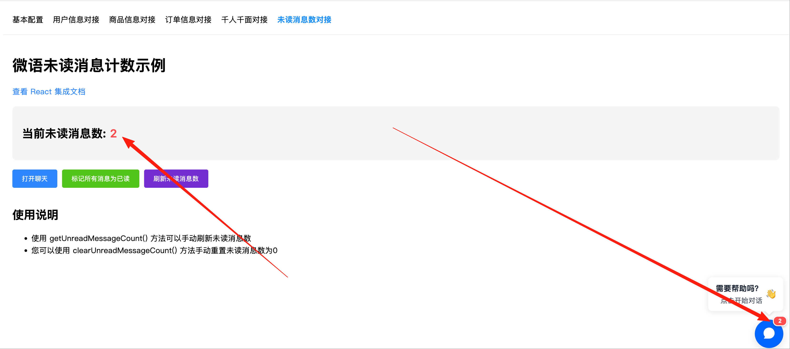

<!--
 * @Author: jackning 270580156@qq.com
 * @Date: 2024-12-28 13:08:41
 * @LastEditors: jackning 270580156@qq.com
 * @LastEditTime: 2025-09-22 10:47:56
 * @Description: bytedesk.com https://github.com/Bytedesk/bytedesk
 *   Please be aware of the BSL license restrictions before installing Bytedesk IM – 
 *  selling, reselling, or hosting Bytedesk IM as a service is a breach of the terms and automatically terminates your rights under the license. 
 *  仅支持企业内部员工自用，严禁私自用于销售、二次销售或者部署SaaS方式销售 
 *  Business Source License 1.1: https://github.com/Bytedesk/bytedesk/blob/main/LICENSE 
 *  contact: 270580156@qq.com 
 *  联系：270580156@qq.com
 * Copyright (c) 2024 by bytedesk.com, All Rights Reserved. 
-->
# bytedesk-web

- [](https://badge.fury.io/js/bytedesk-web)
- [](https://www.npmjs.com/package/bytedesk-web)
- [npmjs](https://www.npmjs.com/package/bytedesk-web)

在线客服web/js-sdk插件:

- [React Guide](examples/react-demo/readme.md)
- [Next.js Guide](examples/nextjs-demo/readme.md)
- [Vue Guide](examples/vue-demo/readme.md)
- [Svelte Guide](examples/svelte-demo/readme.md)
- [Angular Guide](examples/angular-demo/readme.md)
- [JavaScript Guide](examples/javascript-demo/readme.md)



## 基本设置



## 用户系统对接



## 商品信息对接


## 订单信息对接



## 未读消息数



## 文档反馈功能 ✨ 新功能

文档反馈功能是一个创新性功能，允许用户直接针对页面内容提交精准的反馈意见。

### 功能特点

- **智能文本检测**：自动监听页面文本选择事件
- **实时截图生成**：基于 html2canvas 技术自动截取页面状态
- **精准定位**：记录用户选中的具体文字内容
- **友好界面**：简洁美观的反馈对话框
- **灵活配置**：支持多种触发方式和自定义样式

### 使用方法

1. 用鼠标选中页面中的任意文字
2. 自动弹出"文档反馈"提示按钮
3. 点击按钮打开反馈对话框
4. 查看选中文字和页面截图
5. 输入反馈内容并提交

### 配置示例

```javascript
const config = {
  feedbackConfig: {
    enabled: true, // 启用文档反馈功能
    trigger: 'selection', // 触发方式
    showOnSelection: true, // 选中文本时显示提示
    selectionText: '文档反馈',
    dialogTitle: '提交意见反馈',
    placeholder: '请描述您的问题或优化建议',
    onSubmit: (feedbackData) => {
      console.log('收到反馈数据:', feedbackData);
      // 自定义提交逻辑
    }
  }
};
```

### 依赖安装

文档反馈功能需要 html2canvas 库支持截图功能：

```bash
npm install html2canvas
```

[English Document](./readme.md)

- [](https://badge.fury.io/js/bytedesk-web)
- [](https://www.npmjs.com/package/bytedesk-web)
- [npmjs](https://www.npmjs.com/package/bytedesk-web)

## Installation Steps

### Install Dependencies

```bash
npm install bytedesk-web
# 或
yarn add bytedesk-web
```

### 导入组件

```bash
import { BytedeskReact } from 'bytedesk-web/react';
import type { BytedeskConfig } from 'bytedesk-web/react';
```

### 配置参数

```bash
const config: BytedeskConfig = {
  placement: 'bottom-right',
  marginBottom: 20,
  marginSide: 20,
  bubbleConfig: {
    show: true,
    icon: '👋',
    title: 'Need help?',
    subtitle: 'Click to chat'
  },
  buttonConfig: {
    show: true,
    width: 60,
    height: 60,
    // icon: '👋',
    // text: '需要帮助吗？',
  },
  chatConfig: {
    org: 'df_org_uid',  // 替换为您的组织ID
    t: "2",
    sid: 'df_rt_uid'      // 替换为您的SID
  }
};
```

### 使用组件

```bash
const App = () => {
  const handleInit = () => {
    console.log('BytedeskReact initialized');
  };

  return (
    <div>
      <BytedeskReact {...config} onInit={handleInit} />
      <button onClick={() => (window as any).bytedesk?.showChat()}>
        打开聊天
      </button>
    </div>
  );
};
```

### 可用方法

```bash
# 显示/隐藏按钮
(window as any).bytedesk?.showButton();
(window as any).bytedesk?.hideButton();

# 显示/隐藏气泡消息
(window as any).bytedesk?.showBubble();
(window as any).bytedesk?.hideBubble();

# 显示/隐藏聊天窗口
(window as any).bytedesk?.showChat();
(window as any).bytedesk?.hideChat();

# 显示/隐藏邀请对话框
(window as any).bytedesk?.showInviteDialog();
(window as any).bytedesk?.hideInviteDialog();
 
# 获取未读消息数
(window as any).bytedesk?.getUnreadMessageCount()
# 清空所有未读消息
(window as any).bytedesk?.clearUnreadMessages()
```

## 运行示例

```bash
yarn install 
yarn demo:react    # Run React demo
yarn demo:vue      # Run Vue demo
yarn demo:svelte   # Run Svelte demo
yarn demo:vanilla  # Run Vanilla JS demo
yarn demo:angular  # Run Angular demo
yarn demo:nextjs   # Run Next.js demo

# JavaScript demo requires build first
yarn build
yarn demo:javascript 
```

## 服务器

- [Bytedesk](https://github.com/Bytedesk/bytedesk)

## 开源Demo + SDK

| Project     | Description           | Forks          | Stars             |
|-------------|-----------------------|----------------|-------------------|
| [iOS](https://github.com/bytedesk/bytedesk-swift) | iOS  |  |                  |
| [Android](https://github.com/bytedesk/bytedesk-android) | Android |  |   |
| [Flutter](https://github.com/bytedesk/bytedesk-flutter) | Flutter | |  |
| [UniApp](https://github.com/bytedesk/bytedesk-uniapp) | Uniapp |  |  |
| [Web](https://github.com/bytedesk/bytedesk-web) | Vue/React/Angular/Next.js/JQuery/... |  |  |
| [Wordpress](https://github.com/bytedesk/bytedesk-wordpress) | Wordpress |  |  |
| [Woocommerce](https://github.com/bytedesk/bytedesk-woocommerce) | woocommerce |  |  |
| [Magento](https://github.com/bytedesk/bytedesk-magento) | Magento |  |  |
| [Prestashop](https://github.com/bytedesk/bytedesk-prestashop) | Prestashop |  |  |
| [Shopify](https://github.com/bytedesk/bytedesk-shopify) | Shopify |  |  |
| [Opencart](https://github.com/bytedesk/bytedesk-opencart) | Opencart |  |  |
| [Laravel](https://github.com/bytedesk/bytedesk-laravel) | Laravel |  |  |
| [Django](https://github.com/bytedesk/bytedesk-django) | Django |  |  |
